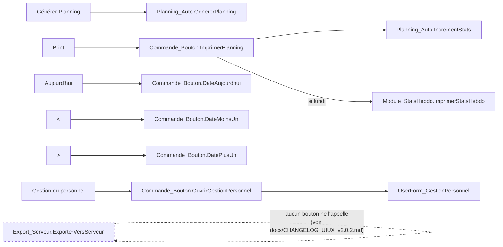
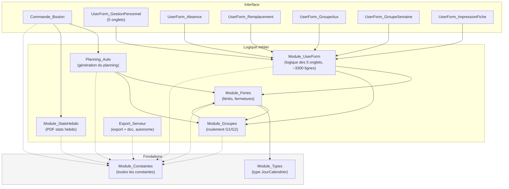
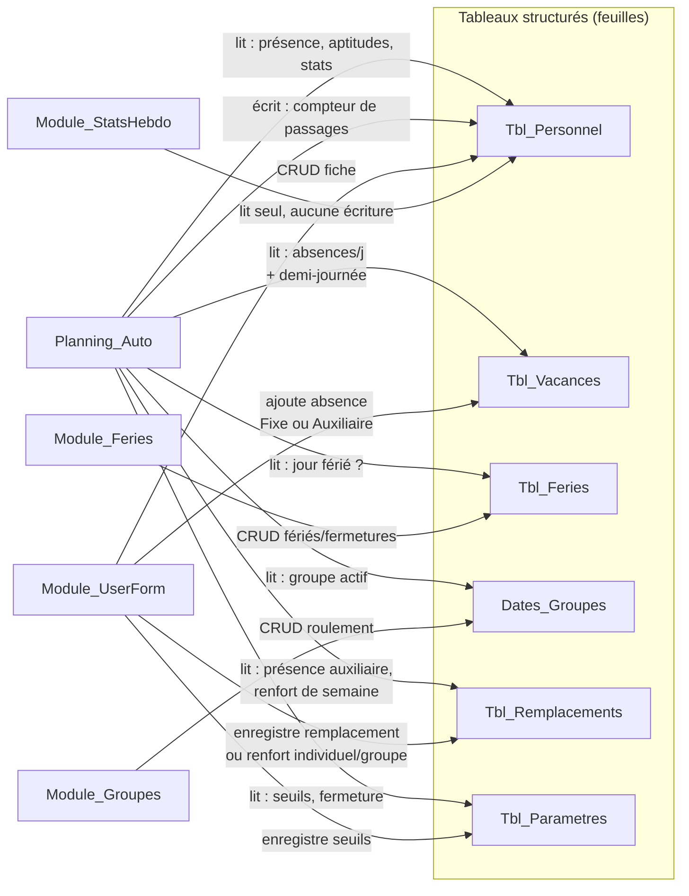

# Architecture — Planning Journalier Automatique

Vue d'ensemble du projet pour reprendre le développement rapidement dans une
future session. Contexte métier complet dans `docs/Prompt_IA.txt`, historique
détaillé des versions dans `docs/CHANGELOG_*.md`.

Le classeur (`workbook/2.0.0_Planning.xlsm`) reste la seule copie exécutable ;
`src/` en est l'extraction texte pour la revue/édition. Après toute
modification de `src/`, les fichiers `.bas`/`.frm` doivent être réimportés
dans l'éditeur VBA du classeur (voir `docs/Prompt_IA.txt`).

## 1. Déclencheurs (boutons de la feuille Planning journalier)

## 2. Dépendances entre modules VBA

*Trait plein = appel de fonction/sub. Trait pointillé = dépend seulement des
constantes (`Module_Constantes`), lu par tous les modules.*

## 3. Flux de données (feuilles/tableaux Excel)

## 4. Feuilles Excel

| Feuille | Tableau | Rôle | Modifiée par |
|---|---|---|---|
| Planning journalier | `Planning_Matin`, `Planning_ApresMidi` | Vue quotidienne, boutons | Planning_Auto, Commande_Bouton |
| Personnel | `Tbl_Personnel` | Identité, horaires, aptitudes, stats | Module_UserForm (fiche), Planning_Auto (stats) |
| Vacances | `Tbl_Vacances` | Absences (+ période depuis v2.0.3) | Module_UserForm |
| Feries | `Tbl_Feries` | Fériés NE + fermetures entreprise | Module_Feries |
| Groupes | `Dates_Groupes` | Roulement G1/G2 par weekend/férié | Module_Groupes |
| Remplacements | `Tbl_Remplacements` | Remplacements + renforts (indiv. ou groupe) | Module_UserForm |
| Parametres | `Tbl_Parametres` | Seuils qté/fermeture par machine, effectif min. | Module_UserForm |
| Index des Versions | — | Historique des versions (voir aussi `docs/CHANGELOG_*.md`) | manuel |
| Liste | — | Vestigial, non référencé par le code (voir audit UI/UX) | — |

## 5. Historique des sessions de travail

1. **v2.0.1** — Revue de code complète (bugs critiques/importants, conventions). Détail : `docs/CHANGELOG_v2.0.1.md`.
2. **v2.0.2** — Audit et corrections UI/UX (feuille Planning journalier, UserForms, feuilles secondaires). Détail : `docs/CHANGELOG_UIUX_v2.0.2.md`.
3. **v2.0.3** — Renfort de groupe hebdomadaire, absences auxiliaires, absences par demi-journée, correction date bloquée. Détail : `docs/CHANGELOG_v2.0.3.md`. **Contrôles restant à créer manuellement dans l'éditeur VBA** avant réimport — liste en fin de ce changelog.

## 6. Limites connues de cet environnement (pour la prochaine session)

- LibreOffice headless ne fonctionne pas dans le bac à sable de développement
  (échoue même sur un fichier vierge) : impossible d'y générer des captures
  d'écran réelles du classeur ou des UserForms. Les mockups fournis
  (artefact "Gestion du Personnel") sont des reconstitutions à partir du code,
  pas des captures.
- Toute modification du classeur `.xlsm` doit passer par édition XML
  chirurgicale (zip + regex ciblés), jamais par un simple load/save
  openpyxl : un aller-retour complet fait perdre le style/couleurs du
  graphique intégré et les `ctrlProps` des boutons Form Control (repéré et
  évité pendant la session v2.0.2 — voir l'historique de conversation pour
  la méthode exacte si besoin de la reproduire).
- Les fichiers `.frm` extraits ne contiennent que le code des contrôles
  existants, jamais leur mise en page (`.frx` binaire non exploité). Ajouter
  un nouveau contrôle à un formulaire nécessite une intervention manuelle de
  l'utilisateur dans l'éditeur VBA — toujours lister précisément les
  contrôles à créer (nom, type, légende) plutôt que de deviner leur mise en page.
